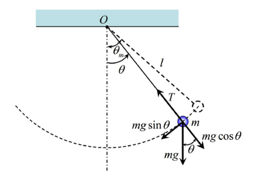

# OGRE3D-Project-Rope-Game
캐릭터가 단진자 운동인 로프운동을 하며 목표지점까지 이동하는 게임

## 1. Project Overview 
+ ### Background 
  * 평소에 프로젝트를 진행할 때 게임으로 주제를 많이 잡아봤지만 게임 엔진을 사용해 보는 것은 처음이었습니다.
  이번 프로젝트에는 OGRE3D라는 게임 엔진을 사용하는데 아직 사용이 능숙하지 못하여 폭넓게 주제를 선정하기 힘들었습니다.
  다양한 기능보다 특징있는 기능 하나로 간단하면서 중독성있는 게임을 고민하던 중 한창 유행하던 "항아리 게임"을 모토로 삼았습니다.
  그래서 로프를 사용해 진자운동을 하면서 목적지까지 도달하는 게임을 주제로 선정하게 되었습니다.
  
+ ### Project Goal
  * OGRE3D 게임 엔진을 이용
  * 완벽한 진자 운동을 구현
  * 적 AI와 싸우기 위해 충돌판정 처리
  
## 2. Development environment/Language
+ ### Development environment
  * Windows 10 - 64bit
  * Visual Studio 15
+ ### Language
  * OGRE3D Engine
  * C++
  
## 3. Project Architecture & Design
+ ### Architecture
  * Character Move
      
  * Characer Shot
     
  * Rope Move
     
  * AI
     
+ ### Design
   
   
   
## 5. How to Make
+ ### OGRE 3D
  * OGRE 3D라는 게임엔진을 이용하여 기본적인 게임 환경과 요소들을 구축
+ ### Implementing the Law of Physics
  * 기존의 물리법칙을 물리엔진을 사용하지 않고 직접 공식화하여 구현 
+ ### Collision Detection
  * 게임 엔진을 이용하지 않고 충돌판정을 고민하여 직접 구현하여 사용

## 6. Doc & Video
+ ### Docs
  * [PPT](doc/PPT.pptx)
+ ### Video
  * [URL](https://www.youtube.com/watch?v=arkPlT1O-zo&feature=youtu.be)
